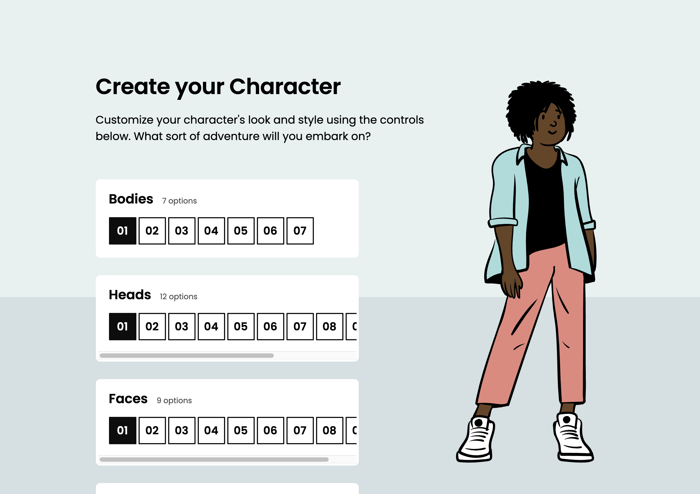

# Character Creation Workshop

In this workshop, you'll build a Sims-style character creation screen.

## Mockups

Desktop:



For this workshop, we're only targeting desktops (although if you're so inclined, creating a mobile variant would make a great stretch goal!).

> Protip: If you're reading this in VS Code, open the Command Palette (Cmd + Shift + P) and select “Markdown: Open Preview to the Side”. That way, you can see all the images in this document!

## Setup Instructions

This project uses create-react-app.

Start by installing dependencies:

```
npm install
```

Boot up a dev server:

```
npm run start
```

You should be able to access the application at `http://localhost:3000`.
